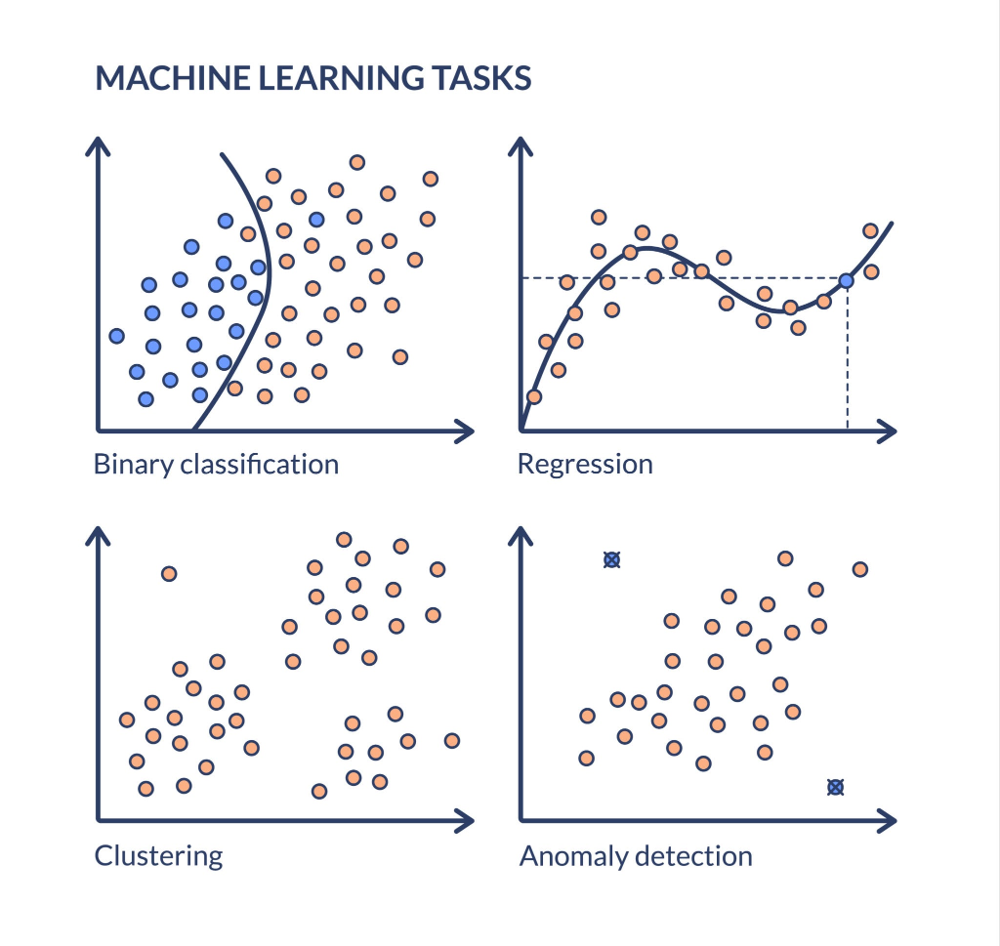
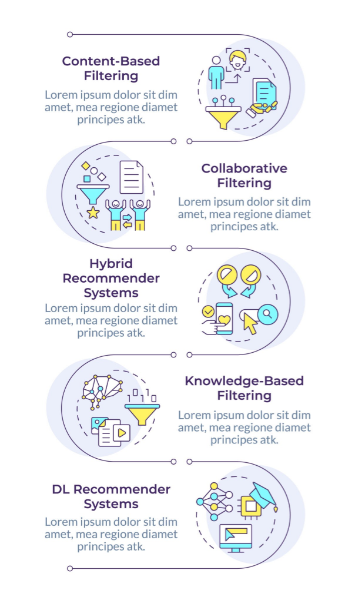

# 📙 Topic 02: Unsupervised Learning & Recommendation Systems

Unsupervised Learning operates on unlabeled data where no target variable ($y$) is provided. The model analyzes raw feature inputs ($X$) to autonomously discover underlying patterns, hidden structures, groupings, and anomalous data points.



---

## 💡 Core Concepts & Algorithms

### 1. Clustering Algorithms

Clustering partitions unlabelled data points into distinct groups such that items within the same cluster exhibit high similarity, while items across different clusters are distinct.

#### **A. K-Means Clustering**
* **Real-World Application:** Customer segmentation for retail platforms (e.g., segmenting customers by income vs. spending score).
* **Algorithm Steps:**
  1. Initialize $K$ random centroids in feature space.
  2. Assign each data point to its nearest centroid using Euclidean distance.
  3. Recalculate centroids as the mean position of all assigned points.
  4. Repeat until centroids stabilize (no position changes).
* **Determining Optimal $K$ (Elbow Method):**
  Plot the **Inertia** (Within-Cluster Sum of Squares) against increasing values of $K$. The optimal number of clusters corresponds to the point where the rate of inertia decrease sharply bends (the "elbow").

#### **B. Hierarchical Clustering**
* **Concept (Agglomerative / Bottom-Up):** Begins with each data point in its own individual cluster and iteratively merges closest pairs of clusters based on linkage distance.
* **Dendrogram Visualization:** A tree-like diagram displaying the sequence of merges to decide optimal cluster cutoffs.

#### **C. DBSCAN (Density-Based Spatial Clustering of Applications with Noise)**
* **Why DBSCAN?** Unlike K-Means, which creates circular/spherical clusters, DBSCAN can discover arbitrarily shaped clusters and automatically identifies noise/outliers.
* **Core Concepts:** Evaluates neighborhood radius ($\epsilon$) and minimum points (`min_samples`) to classify points into **Core Points**, **Border Points**, and **Noise**.

---

### 2. Dimensionality Reduction & Anomaly Detection

#### **Principal Component Analysis (PCA)**
* **Curse of Dimensionality:** Datasets with high feature counts slow down models and increase overfitting risk.
* **Concept:** PCA projects high-dimensional data ($N$ features) onto a lower-dimensional subspace (e.g., 2 or 3 principal components) while preserving maximum feature variance.

#### **Anomaly Detection (Isolation Forest)**
* **Real-World Application:** Credit card fraud detection, server log anomaly detection, and IoT maintenance.
* **Concept:** Isolates anomalies by randomly selecting a feature and split value. Because anomalous points are rare and distinct, they require significantly fewer splits to isolate than normal data points.

---

## 🛍️ Recommendation Systems

Recommendation engines power modern e-commerce and media platforms by suggesting items aligned with user interests and behavioral history.



### Recommender Architecture Comparison

| Type | How It Works | Real-World Example | Main Technique / Metric |
| :--- | :--- | :--- | :--- |
| **Content-Based Filtering** | Recommends items similar to those the user previously liked based on item metadata. | Movie genre tags, article category matching | **Cosine Similarity** |
| **Collaborative Filtering** | Recommends items based on preferences of similar users (User-User or Item-Item). | *"Customers who bought this also bought..."* | **User-Item Matrix, Matrix Factorization (SVD)** |
| **Hybrid Systems** | Combines Content-Based and Collaborative Filtering to resolve cold-start problems. | Spotify Discover Weekly | **Deep Learning Embeddings + Matrix Factorization** |
| **Knowledge-Based Filtering** | Recommends items based on explicit user requirements and domain constraints. | Real estate or custom PC configuration | **Rule-Based Filtering, Constraint Satisfaction** |
| **DL Recommender Systems** | Uses neural networks to model complex non-linear interactions and user sequences. | YouTube & TikTok feed algorithms | **Autoencoders, Recurrent/Transformer Embeddings** |

---

## 💻 Python Implementation Example

The following runnable script demonstrates **K-Means Customer Segmentation** and a **Content-Based Movie Recommendation System** using Cosine Similarity:

```python
import numpy as np
import pandas as pd
from sklearn.cluster import KMeans
from sklearn.metrics.pairwise import cosine_similarity

# -------------------------------------------------------------
# 1. CLUSTERING: Customer Segmentation (K-Means)
# -------------------------------------------------------------
# Feature Matrix: [Annual Income ($k), Spending Score (1-100)]
X_customers = np.array([
    [15, 39], [15, 81], [16, 6], [16, 77], [17, 40], # Low Income
    [55, 42], [58, 60], [60, 49], [62, 53], [64, 42], # Mid Income
    [87, 88], [88, 91], [92, 72], [95, 89], [99, 97]  # High Income
])

# Fit K-Means with K=3
kmeans = KMeans(n_clusters=3, random_state=42, n_init=10)
cluster_labels = kmeans.fit_predict(X_customers)

print("--- CUSTOMER SEGMENTATION RESULTS ---")
for idx, label in enumerate(cluster_labels):
    print(f"Customer {idx+1} (Income: {X_customers[idx][0]}k, Score: {X_customers[idx][1]}) -> Cluster {label}")

# -------------------------------------------------------------
# 2. RECOMMENDATION SYSTEM: Content-Based Recommender
# -------------------------------------------------------------
# Movie Feature Matrix: [Action, Comedy, Romance, Sci-Fi]
movies_data = {
    'Avengers': [1.0, 0.2, 0.0, 0.9],
    'Interstellar': [0.8, 0.0, 0.1, 1.0],
    'The Hangover': [0.1, 1.0, 0.2, 0.0],
    'La La Land': [0.0, 0.3, 1.0, 0.0]
}

df_movies = pd.DataFrame(movies_data, index=['Action', 'Comedy', 'Romance', 'Sci-Fi']).T

# Compute Cosine Similarity Matrix
sim_matrix = cosine_similarity(df_movies)
df_sim = pd.DataFrame(sim_matrix, index=df_movies.index, columns=df_movies.index)

print("\n--- MOVIE RECOMMENDATION SYSTEM ---")
target_movie = 'Avengers'
recommended_movie = df_sim[target_movie].drop(target_movie).idxmax()
similarity_score = df_sim[target_movie].drop(target_movie).max()

print(f"Target Movie: '{target_movie}' | Recommended: '{recommended_movie}' (Similarity Score: {similarity_score:.2f})")
```

---

## 🎯 Practical Exercise Assignment

### Task Title: "The E-Commerce Customer & Product Intelligence Engine"

#### Task 1 (Clustering)
* **Dataset:** Mall Customer Segmentation Dataset (Kaggle).
* **Goal:** Apply **K-Means**, use the **Elbow Method** to find the optimal $K$, and visualize the resulting customer clusters.

#### Task 2 (Recommendation System)
* **Dataset:** MovieLens 100K Dataset.
* **Goal:** Build a **Collaborative Filtering** recommendation model using a User-Item Matrix and Cosine Similarity to output Top-5 movie recommendations for any given `User ID`.
